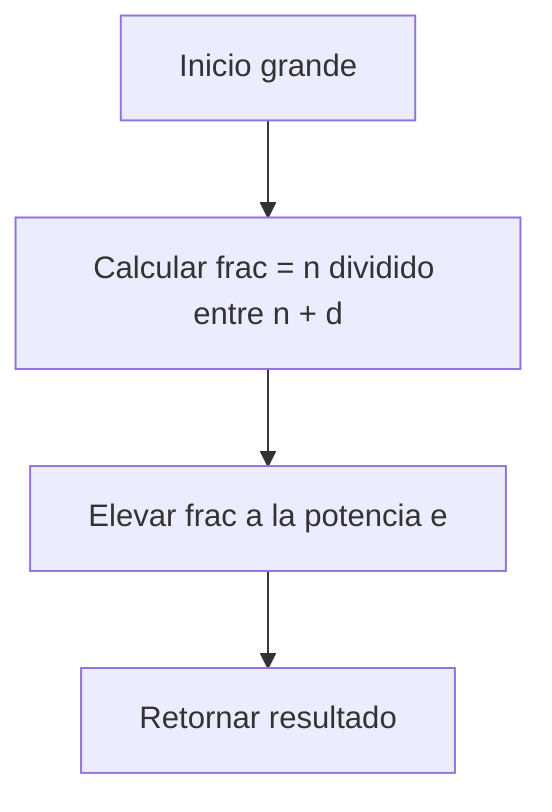
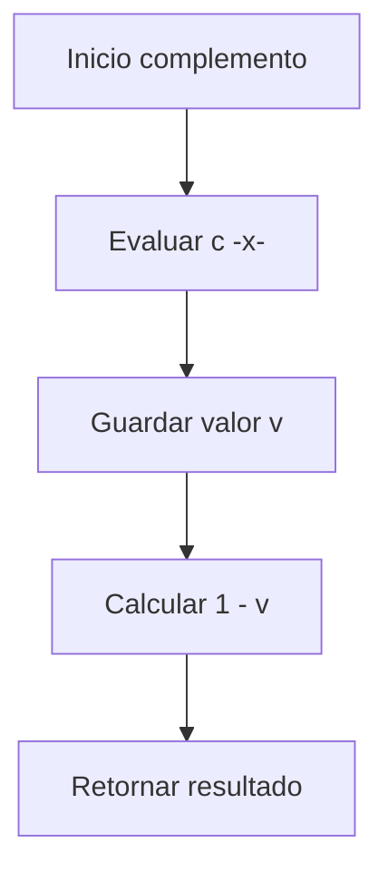
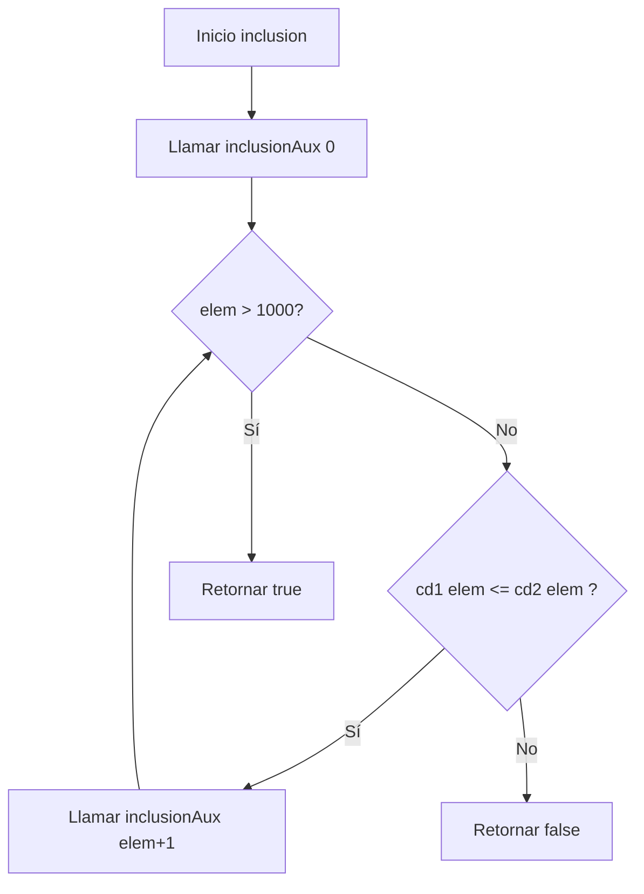

# Documentación de las funciones `grande` y `complemento`

## Función `grande`

### Definición matemática

La función `grande` genera un conjunto difuso que mide qué tan grande es un número entero \(n\).

Su grado de pertenencia está dado por:

$$
f_{\text{grande}}(n) = \left(\frac{n}{n + d}\right)^e
$$

donde:
- $$d \geq 1 $$controla el desplazamiento (entre más grande sea \(d\), más difícil es que \(n\) sea considerado grande).
- $$ e > 1 $$ controla la nitidez (entre más grande sea e, más brusca es la transición entre 0 y 1).

---

## Función `complemento`

### Definición matemática

Dado un conjunto difuso \(S\), su complemento está definido como:

$$
f_{\neg S}(x) = 1 - f_S(x)
$$

Esto significa que:
- Si $$ f_S(x) $$ es cercano a 1 (alta pertenencia), entonces $$f_{\neg S}(x)$$será cercano a 0.
- Si $$ f_S(x) $$ es cercano a 0 (baja pertenencia), entonces $$f_{\neg S}(x)$$ será cercano a 1.


---

## Pila de llamados

Aunque estas funciones no son recursivas, se puede ilustrar la pila de llamados de manera conceptual:





# Documentación de las funciones `inclusion` e `igualdad`

## Función `inclusion`

### Definición matemática

Dados dos conjuntos difusos $S_1$ y $S_2$ definidos sobre el mismo universo $U$, se dice que $S_1$ está incluido en $S_2$ (denotado $S_1 \subseteq S_2$) si y solo si:

$$
\forall x \in U : f_{S_1}(x) \leq f_{S_2}(x)
$$

En nuestra implementación, limitamos el universo al intervalo de enteros $[0, 1000]$ para hacer computable la verificación.

### Implementación recursiva de cola

La función utiliza recursión de cola para verificar la inclusión elemento por elemento:

```scala
def inclusion(cd1: ConjDifuso, cd2: ConjDifuso): Boolean = {
  def inclusionAux(elem: Int): Boolean = {
    if (elem > 1000) true
    else if (cd1(elem) <= cd2(elem)) inclusionAux(elem + 1)
    else false
  }
  inclusionAux(0)
}
```


---
## Función `igualdad`
### Definición matemática
Dos conjuntos difusos $S_1$ y $S_2$ son iguales (denotado $S_1 = S_2$) si y solo si:
$$
\forall x \in U : f_{S_1}(x) = f_{S_2}(x)
$$
### Implementación recursiva de cola
La función utiliza recursión de cola para verificar la igualdad elemento por elemento:
```scala
def igualdad(cd1: ConjDifuso, cd2: ConjDifuso): Boolean = {
  def igualdadAux(elem: Int): Boolean = {
    if (elem > 1000) true
    else if (cd1(elem) == cd2(elem)) igualdadAux(elem + 1)
    else false
  } 
    igualdadAux(0)
}
```
```mermaid
flowchart TD
    A[Inicio igualdad] --> B[Llamar inclusion cd1, cd2]
    B --> C{¿cd1 ⊆ cd2?}
    C -->|No| D[Retornar false]
    C -->|Sí| E[Llamar inclusion cd2, cd1]
    E --> F{¿cd2 ⊆ cd1?}
    F -->|No| D
    F -->|Sí| G[Retornar true]