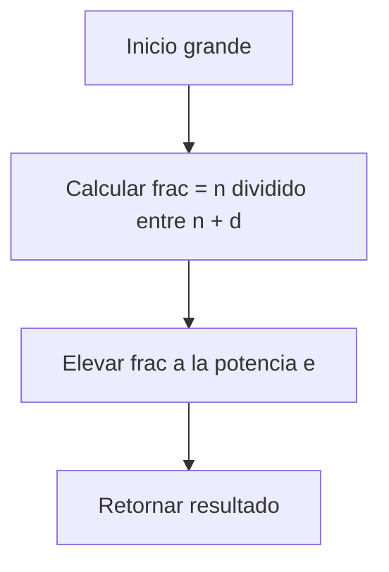
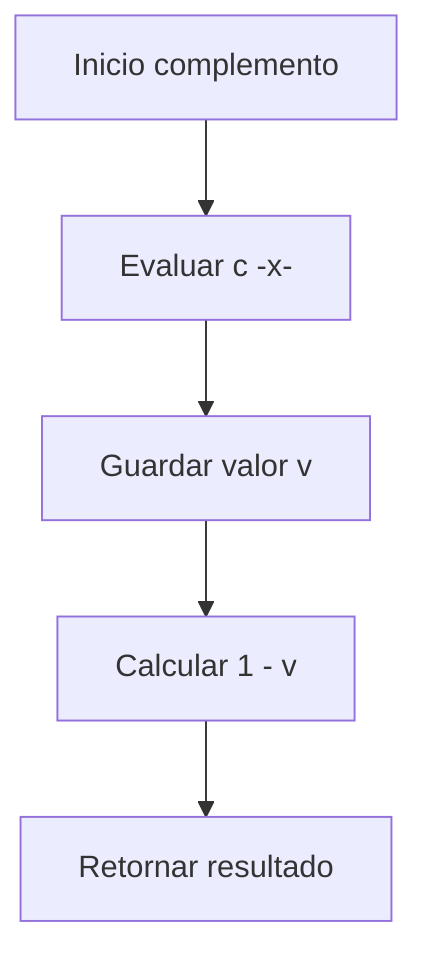

# Documentación de las funciones `grande` y `complemento`

## Función `grande`

### Definición matemática

La función `grande` genera un conjunto difuso que mide qué tan grande es un número entero \(n\).

Su grado de pertenencia está dado por:

$$
f_{\text{grande}}(n) = \left(\frac{n}{n + d}\right)^e
$$

donde:
- $$d \geq 1 $$controla el desplazamiento (entre más grande sea \(d\), más difícil es que \(n\) sea considerado grande).
- $$ e > 1 $$ controla la nitidez (entre más grande sea e, más brusca es la transición entre 0 y 1).

---

## Función `complemento`

### Definición matemática

Dado un conjunto difuso \(S\), su complemento está definido como:

$$
f_{\neg S}(x) = 1 - f_S(x)
$$

Esto significa que:
- Si $$ f_S(x) $$ es cercano a 1 (alta pertenencia), entonces $$f_{\neg S}(x)$$será cercano a 0.
- Si $$ f_S(x) $$ es cercano a 0 (baja pertenencia), entonces $$f_{\neg S}(x)$$ será cercano a 1.

---

## Pila de llamados

Aunque estas funciones no son recursivas, se puede ilustrar la pila de llamados de manera conceptual:

