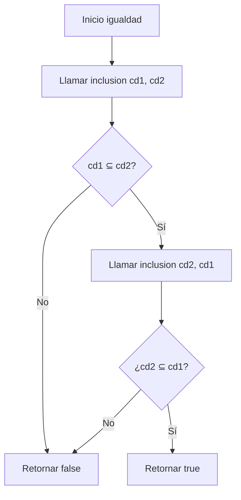
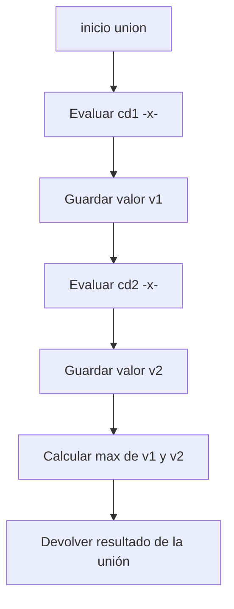
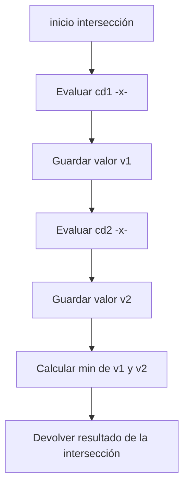

# Documentación de las funciones `grande` y `complemento`

## Función `grande`

### Definición matemática

La función `grande` genera un conjunto difuso que mide qué tan grande es un número entero \(n\).

Su grado de pertenencia está dado por:

$$
f_{\text{grande}}(n) = \left(\frac{n}{n + d}\right)^e
$$

donde:
- $d \geq 1 $controla el desplazamiento (entre más grande sea \(d\), más difícil es que \(n\) sea considerado grande).
- $ e > 1 $ controla la nitidez (entre más grande sea e, más brusca es la transición entre 0 y 1).
### Implementación
La función `grande` se implementa en Scala como una función que retorna otra función (un conjunto difuso):
```scala
  def grande(d: Int, e: Int): ConjDifuso = {
    (n: Int) => {
      val frac = n.toDouble / (n + d).toDouble
      math.pow(frac, e.toDouble)
    }
  }
```
- ## Pila de llamados

Aunque estas funciones no son recursivas, se puede ilustrar la pila de llamados de manera conceptual:


---

## Función `complemento`

### Definición matemática

Dado un conjunto difuso \(S\), su complemento está definido como:

$$
f_{\neg S}(x) = 1 - f_S(x)
$$

Esto significa que:
- Si $ f_S(x) $ es cercano a 1 (alta pertenencia), entonces $f_{\neg S}(x)$será cercano a 0.
- Si $ f_S(x) $ es cercano a 0 (baja pertenencia), entonces $f_{\neg S}(x)$ será cercano a 1.

### Implementación
La función `complemento` se implementa en Scala como una función que toma un conjunto difuso y retorna su complemento(si es 1 es 0, si es 0 es 1, si es 0.5 es 0.5, etc.):
```scala
  def complemento(c: ConjDifuso): ConjDifuso = {
  (x: Int) => 1.0 - c(x)
}
```

---

- ## Pila de llamados
no me deja poner (x) en el diagrama de flujo, por eso puse -x- en vez de (x)


# Documentación de las funciones `inclusion` e `igualdad`

## Función `inclusion`

### Definición matemática

Dados dos conjuntos difusos $S_1$ y $S_2$ definidos sobre el mismo universo $U$, se dice que $S_1$ está incluido en $S_2$ (denotado $S_1 \subseteq S_2$) si y solo si:

$$
\forall x \in U : f_{S_1}(x) \leq f_{S_2}(x)
$$

En nuestra implementación, limitamos el universo al intervalo de enteros $[0, 1000]$ para hacer computable la verificación.

### Implementación recursiva de cola

La función utiliza recursión de cola para verificar la inclusión elemento por elemento:

```scala
def inclusion(cd1: ConjDifuso, cd2: ConjDifuso): Boolean = {
  def inclusionAux(elem: Int): Boolean = {
    if (elem > 1000) true
    else if (cd1(elem) <= cd2(elem)) inclusionAux(elem + 1)
    else false
  }
  inclusionAux(0)
}
```


---
## Función `igualdad`
### Definición matemática
Dos conjuntos difusos $S_1$ y $S_2$ son iguales (denotado $S_1 = S_2$) si y solo si:
$$
\forall x \in U : f_{S_1}(x) = f_{S_2}(x)
$$
### Implementación recursiva de cola
La función utiliza recursión de cola para verificar la igualdad elemento por elemento:
```scala
def igualdad(cd1: ConjDifuso, cd2: ConjDifuso): Boolean = {
  def igualdadAux(elem: Int): Boolean = {
    if (elem > 1000) true
    else if (cd1(elem) == cd2(elem)) igualdadAux(elem + 1)
    else false
  } 
    igualdadAux(0)
}
```


# Documentación de las funciones `union` y `intersección`
## Objetivo
Este proyecto se realizó con el objetivo de implementar (usando Scala) las operaciones de unión e intersección de conjuntos difusos.

`1. ` **Union**: La unión de dos conjuntos difusos se refiere a la combinación de multiples conjuntos difusos en un solo conjunto, es definido como el maximo de los grados de pertenencia de los conjuntos individuales. 

`2. ` **Intersección**: La intersección de dos conjuntos difusos se refiere a los elementos que son comunes a ambos conjuntos, es definido como el minimo de los grados de pertenencia de los conjuntos individuales.
## Función `union`
### Definición matemática
Dado dos conjuntos difusos $S_1 \;\text{y}\; S_2$, la union de estos $S_1 \cup S_2$ está definida por:  
$$
f_{S_1 \cup S_2}(x) = \max(f_{S_1}(x), f_{S_2}(x))
$$
Esto quiere decir que, para cada elemento x, su grado de pertenencia está definido por el mayor valor de pertenencia entre los dos conjuntos.
### Explicación del código
```scala
def union(cd1: ConjDifuso, cd2: ConjDifuso): ConjDifuso = {
  (x: Int) => Math.max(cd1(x), cd2(x))
}
```
- Primero que nada, definimos la función union, la cual recibe como parametros a 2 conjuntos difusos y devuelve un conjunto difuso.
- Luego, retornamos una función anónima que toma un entero x y devuelve el máximo entre los grados de pertenencia de x en ambos conjuntos difusos.

### Pila de llamados

## Función `intersección`
### Definición matemática
Dado dos conjuntos difusos $S_1 \;\text{y}\; S_2$, la union de estos $S_1 \cap S_2$ está definida por:  
$$
f_{S_1 \cap S_2}(x) = \min(f_{S_1}(x), f_{S_2}(x))
$$
Esto quiere decir que, para cada elemento x, su grado de pertenencia está definido por el menor valor de pertenencia entre los dos conjuntos.
### Explicación del código
```scala
def interseccion(cd1: ConjDifuso, cd2: ConjDifuso): ConjDifuso = {
  (x: Int) => Math.min(cd1(x), cd2(x))
}
```
- Primero que nada, definimos la función intersección, la cual recibe como parametros a 2 conjuntos difusos y devuelve un conjunto difuso.
- Luego, retornamos una función anónima que toma un entero x y devuelve el mínimo entre los grados de pertenencia de x en ambos conjuntos difusos.

### Pila de llamados
